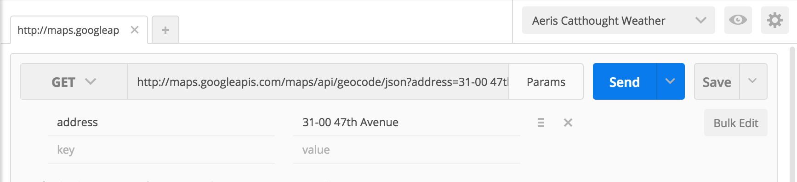

# AC3.2-APIs: Intro
---
### Contents
0. Intro
 1. [Readings](https://github.com/C4Q/AC3.2-APIs/blob/master/README.md#readings)
 2. [Resources](https://github.com/C4Q/AC3.2-APIs#resources)
 3. [Objectives](https://github.com/C4Q/AC3.2-APIs/blob/master/README.md#objectives)
1. APIs in Concept
 1. [APIs, What Are They?](https://github.com/C4Q/AC3.2-APIs#apis-what-are-they)
 2. [Why Do APIs Matter](https://github.com/C4Q/AC3.2-APIs#why-do-apis-matter)
 3. [JSON (a deeper dive)](https://github.com/C4Q/AC3.2-APIs#json-a-deeper-dive)
 4. [API Documentation](https://github.com/C4Q/AC3.2-APIs#api-documentation)
 5. [Trying out an API](https://github.com/C4Q/AC3.2-APIs#trying-out-an-api)
2. Working with Requests
 1. [Postman](https://github.com/C4Q/AC3.2-APIs#postman)
 2. [Testing API Requests and myjson](https://github.com/C4Q/AC3.2-APIs#testing-api-requests-and-myjson)
 3. [The RandomUserAPI](https://github.com/C4Q/AC3.2-APIs#the-random-user-api)
3. iFacesterGram (Project)
 1. [iFacesterGram: Concept to Demo](https://github.com/C4Q/AC3.2-APIs#ifacestergram-concept-to-demo)
   - [Design and Engineering](https://github.com/C4Q/AC3.2-APIs#design--engineering)
    - [Project Orientation](https://github.com/C4Q/AC3.2-APIs#project-orientation)
 2. [Designing the `User` Model](https://github.com/C4Q/AC3.2-APIs#designing-the-user-model)
 3. [Coding the `APIRequestManager`](https://github.com/C4Q/AC3.2-APIs#coding-the-apirequest-manager)
 4. [Parsing Data in Our Model](https://github.com/C4Q/AC3.2-APIs#parsing-data-in-our-model)
 5. [Pull-to-Refresh](https://github.com/C4Q/AC3.2-APIs#pull-to-refresh)
 6. [Exercises](https://github.com/C4Q/AC3.2-APIs#exercises)
   - [1. More Requests](https://github.com/C4Q/AC3.2-APIs#1-more-requests)
    - [2. Error Handling](https://github.com/C4Q/AC3.2-APIs#2-error-handling-exercise-to-be-done-after-error-handling-lesson)
 
---
### Readings

1. [What is an API? - Mulesoft via Youtube](https://www.youtube.com/watch?v=s7wmiS2mSXY)
 - This is a very quick and helpful video (must watch)
2. [REST API Concepts - Webconcepts via Youtube](https://www.youtube.com/watch?v=7YcW25PHnAA)
 - This is a slightly longer, practical look at REST API's (must watch)
3. [What is an API in English, Please](https://medium.freecodecamp.com/what-is-an-api-in-english-please-b880a3214a82#.jxvvtoarm)
 - If you understood the two videos above this link, you don't really have to read this article
4. [Basics of Pull to Refresh - Andrew Bancroft](https://www.andrewcbancroft.com/2015/03/17/basics-of-pull-to-refresh-for-swift-developers/)

### Resources:
1. [Postman](https://www.getpostman.com/) - Free tool to test API requests
2. [Random User API](https://randomuser.me/) - Simple API useful for simple user creation
3. [Google Geocoding API: Intro](https://developers.google.com/maps/documentation/geocoding/intro)

---
### Objectives

1. Introduce the concept of web-based APIs along with examples of popular webservices
2. Frame using APIs as being able to develop amazing apps that would not be possible on your own or without large development teams
4. Further dive into JSON by exploring Google Geocode responses
5. Explore API documentation to understand how an API defines its inputs and outputs
6. Introduce Postman as a utility for quickly testing APIs
7. Begin working on iFacesterGram

---
 
### API's, What Are They? 

> **How many weather apps do you think there are in the app store?**

I’d wager there must be in the *thousands*, at least. Some of those apps have entire teams dedicated to building the app, while some of them are a single person; a person who might have just done it as a weekend project. And despite the great variety of apps made, all of their data is (relatively) consistent.
 
But where are those developer teams, large and small, getting their weather data? I mean here you have 1000’s of different apps and they all have the same data set. How are they able to all present the same information?
 
The answer: from an __API__ (Application Programming Interface)

An API is a digital middleman - delivering data from some service as long as you ask for it in the right way. In this case, all of these weather apps are asking a weather-related API for data on the weather. In a broad sense **an API is a standard set of requests and responses that allows software to communicate.** And it is not just iOS apps that use API's: websites use them, Android devices use them, and computers use them. 
 
When iOS developers talk about API's we usually mean one of two things: 

1. Any library used to do a specific function in an app (for example UIKit could be considered a native iOS API for UI elements)
2. A REST API that is used to communicate with some service on the web, (like a weather API!)
 
----
### Why do APIs matter
 
__They allow you to develop software faster!__ The existance of APIs let you perform a variety of tasks that just take way too long to write out yourself. Can you imagine having to write out your own custom `JSONSerialization` function for every app you create?
 
In the context of web-based `REST API`s, they are how your app is going to talk to the world. There are hundreds of services out there that you might want to develop an app around

- A messaging app might use [Firebase](https://firebase.google.com/) for realtime communication
- A social media app that aggregates your top tweets will make use of the Twitter API ([Fabric](https://get.fabric.io/))
- A cloud-based, file storage app may decide to use the [Dropbox API](https://www.dropbox.com/developers) for storing, retrieving and editing files
- Perhaps you have a new take on location-based B2B services, and will make use of the [Foursquare API](https://developer.foursquare.com/) to load local business data
- Have a way to track pokemon in PokemonGo? Seems like a good place to use the [Google Maps API](https://developers.google.com/maps/) to display live GPS data
 
Apps can use multiple `REST` API's to perform complex tasks and create novel experiences for their users. With enough practice and skill, you can even develop your own APIs that other developers will use
 
---
### JSON (A deeper dive)

Since there is a wide possibility of devices that use API's and many differnt APIs providing unique services, there needs to be a standard for how they can all communicate effectively. The most common format in use is `JSON` (Javascript Object Notation). `JSON` defines how the data returned from an API will be formatted, and at its core is really just a dictionary. You may even often hear json referred to as a "json dictionary." Though, the structure and content that json dictionary's key/value pairs is up to the API. This is what we mean when we say that __"an API defines it's data response"__.
 
To get a sense of what JSON looks like, and how its used, let's go ahead and navigate to: http://maps.googleapis.com/maps/api/geocode/json
 


Not an exciting result, but there's way more here than you might initially expect. For one, we see that the page is essentially a dictionary with three keys, `error_message, results, and status`. But why those three keys, and how can we know to expect them? And moreover, how did we know to go to that URL to even try this out?
 
----
### API Documentation

As mentioned before, API's define a standard for how software can communicate. Meaning that they define the kinds of *requests* that can be made to them, along with the *response* they will return. `JSON` defines the structure and syntax of the request/response, but its up to the API as to what should be included in a request and what could be included in the response. 
 
 All APIs will provide documentation on exactly what they expect in a request, and what they will return in a response. 
 
 
 
  
  
> If we check out https://developers.google.com/maps/documentation/geocoding/intro we'll be able to see every possible request and response that can be made by the API.

----
### Trying out an API

So looking at our previous request:

`http://maps.googleapis.com/maps/api/geocode/json`

... we see we're getting back an error. And judging by the APIs documentation, this is expected. Fortunately in the event of a bad request to an API, it is possible that the API returns a response with helpful error messages regarding what was bad about the request. In this case, we made an "invalid request" because we didn't include some additional information it was expecting to get along with the request. This additional information passed along with a request is called **parameters**. Parameters specify additional constraints on the requests we make. They may limit the data requested by filtering it by some criteria. 
 
<details>
  <summary> Example 1: Adding An Address to the API call </summary>
Go back to your prior request and add the "address" key along with a "value" of the address of C4Q
For example: http://maps.googleapis.com/maps/api/geocode/json?address=%2243-06%2045th%20Street%22

Note: Parameters appear following a single ? and spaces are replaced by %20 for the actual request, but the google api will understand the request the exact same way as if you put in "43-06 45th Street"
</details>

<details>
  <summary> Example 2: Compare valid request with invalid one </summary>
  1. Notice how we get new data passed along with a valid request? 
  2. Bring up the API documentation page again and compare the keys with what the API states will be returned
  3. All of these results are listed in the API's documentation for this kind of response, so we will always know what to expect
</details>

Plugging away in a web browser is a lightweight way to test out an API, but we can get some real power by using some utilities specifically meant for making API requests.
 
 -----
### [Postman](https://chrome.google.com/webstore/detail/postman/fhbjgbiflinjbdggehcddcbncdddomop?hl=en)

Try this out: 

1. Open Postman and enter the prior googleAPI request (http://maps.googleapis.com/maps/api/geocode/json)
2. Add in "address" as a parameter along with some value
3. If this worked, try some other addresses



```json
{
  "results": [
    {
      "address_components": [
        {
          "long_name": "The Falchi Building",
          "short_name": "The Falchi Building",
          "types": [
            "premise"
          ]
        },
        {
          "long_name": "31-00",
          "short_name": "31-00",
          "types": [
            "street_number"
          ]
        },
        
        // ... much more json...
        
       ]
     }
   ]  
 }
```


---
### Testing API Requests and [myJson](http://myjson.com/)

Think back to the `URLSession` demo: I was calling our hosted `json` an "API endpoint". And in some ways it does meet the requirement: we could send a request to the `URL` and we would receive a formatted `json` response. And at its core, an API is just a way to request and receive  info based on a set of parameters. Though, in practice API's are a bit more detailed than simply plugging in a `URL` endpoint and parsing out any data that gets returned. And it's likely that you'll be working with API's with incredible frequency in your development careers. 

Making test requests is a big part of software, and iOS, development. So much so that a fellow developer created the myjson site after he became annoyed that there were no simple ways of hosting json with the intention of testing network requests and json parsing. Making web requests, specifically to service APIs, and parsing the returned response is going to be a part of a vast majority of iOS apps. Think about all the apps you use that you can log in with Facebook! That's it's own API that needs integration in an iOS app.

Fortunately, since working with API's is such a ubiquoitous thing for all developers (especially ios, android and web) there are quite a few resources and tools available to make development as smooth as possible. Some of the most important tools are those that let us test out API requests to verify that our inputs and outputs are correct and what we expect. 

---
### The [Random User API](https://randomuser.me/)
One of my favorite APIs to use for quick testing of creating user accounts is the [Random User API](https://randomuser.me/). 
Many of the APIs discussed prior require some sort of authentication method, but fortunately the Random User API doesn't require it making it quite easy to hit the ground rounning with testing with it. 

> Side note, I found an easter egg in the source code of the site's documentation page and tweeted at the developer with my own take on it 😀 (it was a function named like konamiCode()). Could be a nice little anecdote on the development community culture in general. - Louis


<blockquote class="twitter-tweet" data-lang="en"><p lang="en" dir="ltr">nice easter egg <a href="https://twitter.com/solewolf1993">@solewolf1993</a> .. needs more iddqd though. is it open for api requests? <a href="http://t.co/7djehsLWx4">http://t.co/7djehsLWx4</a></p>&mdash; Louis Tur (@louistur) <a href="https://twitter.com/louistur/status/587827969529348096">April 14, 2015</a></blockquote>
<script async src="//platform.twitter.com/widgets.js" charset="utf-8"></script>


---
### iFacesterGram: Concept to Demo

Today is the beginning of the rest of everyone's social media account lives: we're going to start creating a brand new social platform called, iFacesterGram. We've lined up about $250,000 in seed money from an anonymous [angel investor](http://www.investopedia.com/terms/a/angelinvestor.asp) who attended our idea pitch event last week. Now it's time to get our little product off the ground. Our PM team wants us first to showcase what a list of users in the app would look like -- a sort of iFacesterGram "friends list." To complete this first assignment, we're going to need to accomplish a few things:

1. Set up a basic UI to display our list of users
2. Design a way to perform network calls to an API backend to get user data
 - We're going to have to use some mock data for now, but we want robust sets of data
3. Create our `User` model and decide how to parse data
4. Populate our list of users
5. Implement a pull-to-refresh feature

#### Design & Engineering
<details>
  <summary> Q1: What UI element should we use to display the list of users? </summary>
  UITableviewController
  (Possibly) A custom UITableviewCell
</details>
<details>
  <summary> Q2: Based on what we know, what architetural design could we use for a network manager? </summary>
  Singleton
</details>
<details>
  <summary> Q3: What class in the Swift Library can we use to parse raw data from URLRequests?</summary>
  JSONSerialization
</details>
<details>
  <summary> Q4: What will we need to do to ensure that our list of users updates as soon as our network request finishes?</summary>
  Wrapping up UI updating in a DispatchQueue.main.async block
</details>

#### Project Orientation

We begin this project with a few things already set up for us (read through and get familiar with the project):

1. Three files already added:
 - `User.swift` : `struct` for our model
 - `UsersTableViewController`: our primary view controller to display `Users`
 - `APIRequestManager` : our singleton to manage network requests
2. Storyboard has the following:
 - An instance of `UsersTableViewController` with an embedded `UINavigationController`, set as the initial view controller
 - A single prototype `UITableViewCell` with the identifier `UserTableViewCellIdentifier`
 
 
<details>
 <summary> Q1: What does <code>private static let</code> indicate about our <code>UserTableViewCellIdentifier</code>?</summary>
  <ol>
   <li>Private indicates that the constant is only available to be used inside of the UsersTableViewController class</li>
   <li>Static indicates that this constant belongs to the UsersTableViewController class and not any 1 instance</li>
   <li>let indicates that the value does not change</li>
  </ol>
 </details>
 
---
### Designing the `User` model

Let's take a look at the data that would could potentially be working with. In Postman, set your URL to the random user API endpoint (`https://randomuser.me/api/`) and hit "send" to make a request. Look at the `json` that is returned.. what should we use to populate our user data? 

<details>
<summary> What data should our social media app keep on a user for display?</summary>
 There really is no wrong answer to thing, and it all depends on the design we'd like for our app. We're going to start off using first, last, city, state, username, email, id, and thumbnail 
</details>

Now, let's fill out the `User` model using these properties

```swift 
internal struct User {
    internal let firstName: String
    internal let lastName: String
    internal let city: String
    internal let state: String
    internal let username: String
    internal let emailAddress: String
    internal let id: String
    internal let thumbnailURL: String
}
```

---
### Coding the `APIRequest Manager`

For right now, our request manager just needs to be able to do a few things: 

1. Send a request to the random user API endpoint
2. Do some basic error checking
3. Use a callback closure to handle the returned `Data`

Using what you know, and the previous lessons, design a singleton-based manager class with the function `func getRandomUserData(completion: ((Data?)->Void))`. One you have it set up, call the function inside of the `viewDidLoad` of `UsersTableViewController` and make sure you're getting data and/or handling an error by printing its details out to console.

```swift
   APIRequestManager.manager.getRandomUserData { (data) in
       if data != nil {
          print("Data returned!")
       }
   }
```

<details>
<summary> Q1: Our function definition is missing one thing, what is it? </summary>
It needs the <code>@escaping</code> key word for the callback closure
</details>

<details>
<summary> Design Hints </summary>
A singleton needs two things: a class-level unchanging constant <code>manager</code>, and a private default initializer.
Its quite helpful to define unchanging properties (such as the URL for the api) as a <code>static let</code>
</details>

> __The more you know!__
> Notice how there is a _ton_ of useless messages being printed to your console? That's an annoying new addition to the latest version of Xcode. To silence this noise, hold down <kbd>Option</kbd> while clicking on the Run button (with the play button icon) in Xcode to bring up the "Scheme Manager". Under "Environment Variables", add a new entry with the name `OS_ACTIVITY_MODE` with a value of `disable`. Now click "Run" and see a much cleaner console output! 

---
### Parsing `Data` in our model

Structs are nice in Swift because they give you a "free" initializer based on its properties (as long as you don't write your own). In this instance, we're going to use our free initializer, but we're going to be a bit more architecture-focused in how we do it. We're going to use a `static func` on `User` that takes in `Data` and returns `[User]?`. This `static func` is essentially going to be like our `InstaCatFactory`.

Guidelines:

1. The function signature looks like `static func users(from data: Data) -> [User]?`
2. Make as many smaller functions as you'd like in order to convert from `Data` into `[User]` (you can also use none, if you'd like, and just put all of the code inside of `users(from:)`)
3. Test this thoroughly by running the app multiple times

In `viewDidLoad` update the call to be:

```swift 
  APIRequestManager.manager.getRandomUserData { (data) in
    if data != nil {
                
      if let users = User.users(from: data!) {
         print("We've got users! \(users)")
      }
    }
  }
```

#### Lecture Notes Update:

1. Ignore the `let id: String` constant in `User` for now (this value is occasionally `nil`)
 - Alternatively, if you've done the normal casting and it all works, adjust the `id` parameter to be an `Optional`
2. You'll run into an issue with casting from `"location"` if you attempt to cast it's contents to `[String : String]`. The reason being that the value for the `postalCode` key is an `Integer`. So the cast will fail if you try to set it as a `[String: String]`. There are different approaches to how to handle this, but it might be easiest to get the value of `jsonDict["location"] as? [String : AnyObject]`, followed by getting the value for the `state` and `city` keys as `String`

#### Handling Errors
As you parse out the `Any` object into arrays and dictionaries, I would recommend adding `print` statements along the way to see where something is working or failing

#### Populating the cells simply
Set the cell's `textLabel` to display a user's first and last name, and the `detailLabel` to display their username

<details>
<summary>Implementation Hints</summary>
You'll have to update <code>numberOfRows, numberOfSections, and cellForRow</code>

You may want to add a variable to the tableview controller <code>internal var users: [User] = []</code>

Don't forget to update your UI properly! There's a special closure to bring stuff over from the "other" road into the "main" road
</details>

---
### Pull to Refresh

Re-running the project to get different data sets is kind of time consuming. It would be much better if we could just do the standard pull-to-refresh action wouldn't it? Heck yea. 

Select the `UserTableViewController` in storyboard and open it's `Attribute Inspector`. Change the `Refreshing` value from `Disabled` to `Enabled`

In `UserTableViewController` create a new function called `func loadUsers()` and add in all of our `APIRequestManager` code to it. Then in `viewDidLoad` add `self.loadUsers()`

Create a new function called `func refreshRequested(_ sender: UIRefreshControl)` and have it call our `loadUsers()` function

Back in `viewDidLoad`, add `self.refreshControl?.addTarget(self, action: #selector(refreshRequested(_:)), for: .valueChanged)`

Now run the project and try it out. Not perfect, but one step closer. 

---
### Exercises

#### 1. More Requests
Create three more functions for our `APIRequestManager`:

1. `func getRandom(users: Int, completion: ((Data?)->Void) )`
2. `func getRandom(users: Int, gender: UserGender, completion: ((Data?)->Void) )`
3. `func getRandom(users: Int, nationality: UserNationality, completion: ((Data?)->Void) )`

For each of these, the `users` parameter will be an `Int` that will change the number of results returned on an API call. `UserGender` and `UserNationality` should be two `enum` that correspond to the possible options as listed in the RandomUserAPI documentation (including a "no-preference" option). 

<details><summary>Code Hints</summary>

<ol>
<li> Your enums will look like this: <code>enum UserGender: String { ... }</code> and <code>enum UserNationality: String { ... }</code>
<li> Constructing URL's is more easily done by starting off with a <code>String</code> and then later using <code>URL(string:)</code> when the string is ready.
<li>Pay attention to the documentation on making requests with parameter. 
</ol>

</details>

__Advanced__

Using default parameter values, find a way to condense **all** of the four functions we now have in `APIRequestManager` into just one.

#### Resources for Advanced: 

1. [Why You should love default parameter values - Natasha the Robot](https://www.natashatherobot.com/swift-default-parameter-values/)
2. [Parameter Defaults and Optional Function Parameters](https://craiggrummitt.com/2016/06/29/parameter-defaults-and-optional-function-parameters-in-swift-3-0/)

__Expert__

Create a separate "factory" class to generate the appropriate `URL` given the different possible parameters of `users`, `nationality` and `gender`. Call this factory `RandomUserURLFactory` with a singleton called `manager`. This factory class is intended to be used by the `APIRequestManager`.

`RandomUserURLFactory` will have one function: `func endpoint(users: Int, nationality: [UserNationality], gender: UserGender) -> URL`. From those parameters, build an appropriate URL to make a request. There are no particular rules on how you should go about doing this, so feel free to explore code. Just be sure to use Postman to test URLs and make sure you have an understanding of the format of the parameters.

Examples:

| | |
|---|---|
|Input|`RandomUserURLFactory.manager.endpoint(users: 10, nationality: [.GB], gender: .male)`|
|Output| `https://randomuser.me/api/?results=10&nat=GB&gender=male` |

| | |
|---|---|
|Input| `RandomUserURLFactory.manager.endpoint(users: 2, nationality: [.AU,.BR,.GB], gender: .noPreference)` |
|Output| `https://randomuser.me/api/?results=2&nat=AU,BR,GB&gender=` |


---
#### 2. Error Handling Exercise (To be done after error handling lesson)

Part 1: Returning an error:

Printing out that an error has occurred is helpful and all, but it's not exactly the best way to handle errors. The point of errors is that you can detect them and then deal with them "gracefully". With that in mind, we're going to have our `users(from:)` function potentially return an `Error`. Change the function to `static func users(from data: Data) -> ([User]?, UserError?)` and update the code so that each one of the `guard else` statement returns a different error corresponding to the casting that failed.
Note: `UserError` will be an enum that conforms to `Error` and has multiple cases for each of the potential errors. 

__Advanced__

Returning a tuple is fine, but let's instead define a new tuple called `UserParseResults` that is of type `([User]?, UserError?)`

#### Resources for Advanced:

1. [Swift Typealias to the Rescue](https://medium.com/swift-programming/swift-typealias-to-the-rescue-b1027fc571e3#.mhysgw83q)
2. [Swift Typealiases - Ash Furrow via Artsy Blog](http://artsy.github.io/blog/2016/06/24/typealias-for-great-good/)

__Expert__

Instead of errors returned, have your `users(from:)` `throw` a `UserError`. Update your function calls in `viewDidLoad` to account for this change. 
